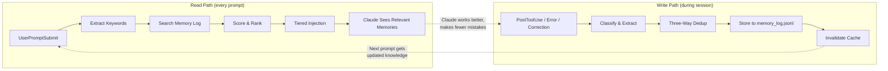

# Cortex

**Self-correcting memory for Claude Code.**

250 tokens. Zero vector databases. Gets smarter every session.

---

Cortex gives Claude Code a memory that learns from its mistakes. It automatically captures what Claude learns during a session, stores it with three-way deduplication, and injects only what's relevant into the next prompt -- at a cost of 250-750 tokens per prompt, or 0.37% of Claude's 200K context window.

## The Problem

Every Claude Code session starts from zero. Claude makes the same mistakes, asks the same questions, and forgets every correction you gave it yesterday.

The standard fix is CLAUDE.md -- a static file that loads 5,000-15,000+ tokens into every prompt whether relevant or not. You maintain it by hand. It has no search, no prioritization, and no way to learn from errors. You are the memory system, manually copying lessons into a file and hoping Claude reads the right paragraph.

You are repeating yourself to an amnesiac, and the amnesiac does not know it.

## Why Cortex

**Self-Correcting.** When you correct Claude, that correction gets a 1.5x priority boost. Old memories decay exponentially. Duplicates are caught by Jaccard similarity and either skipped, superseded, or merged. The system converges toward accuracy without manual curation.

**Looping.** Capture, Store, Search, Inject, Learn, Repeat. Every session feeds the next. Hooks fire automatically on errors, corrections, test results, and session ends. No SDK calls, no manual saves, no "remember this" commands.

**250 Tokens, Not 15,000.** Hard cap of 4,000 characters (~1,000 tokens) enforced in code. Tiered injection: HOT results get full content, WARM results get summaries, COLD results are omitted. When nothing is relevant, the injection is ~30 tokens. Compare that to CLAUDE.md loading everything, every time.

**Zero Infrastructure.** Python stdlib only. No vector database. No embeddings API. No Docker. No external services. Optional Gemini API key enables semantic query expansion, but the core system works without it.

## How It Works



On every prompt, the read path searches 6,000+ entries in milliseconds, scores them against the current context, and injects only what matters. On every tool use, error, or correction, the write path captures the learning and stores it with deduplication. The loop closes: better memories produce better work, which produces better memories.

## The Scoring Algorithm

Each memory entry is scored by a multi-signal pipeline:

```
score = (idf_keyword_score + stem_score + substring_score)
        * tag_boost(2.0)
        * type_boost(1.5 for corrections)
        * recency_decay(e^(-0.03 * days_old))
        * coverage_factor
```

**IDF-weighted keywords** prevent common terms from dominating. **Stem matching** catches morphological variants. **Substring matching** handles compound terms. **Tag boost** (2x) rewards entries explicitly tagged for the current domain. **Type boost** (1.5x) prioritizes corrections over general notes. **Recency decay** fades old memories while keeping recent ones sharp. **Coverage factor** rewards entries that match multiple query terms.

This pipeline was A/B tested against SQLite FTS5. On 10 benchmark queries across a 4,400+ entry corpus, Cortex scored 10/10 correct top results. FTS5 scored 4/10. Soundex was tested and removed at scale -- with only ~7,000 unique phonetic codes, false positive rates were unacceptable.

A SQLite cache layer provides 12-56x speedup on repeated queries with verified identical results.

Full details in [ARCHITECTURE.md](docs/ARCHITECTURE.md).

## Quick Start

```bash
pip install cortex-memory
cortex-install
```

`cortex-install` does three things:

1. Creates `~/.cortex/` with the memory log, core memory file, and cache database.
2. Registers Claude Code hooks in `~/.claude/settings.json` -- the hooks that fire on every prompt, tool use, and session end.
3. Prints a confirmation with the paths it created.

On your first session after installation, Cortex has no memories. It injects ~30 tokens (just the memory directive). As you work, it captures learnings automatically. By your second session, Claude remembers what it learned. By your tenth session, it knows your codebase, your preferences, and the mistakes it should never repeat.

## Comparison

| System | Context Cost | Dependencies | Auto-Capture | Search Method | Self-Correcting |
|--------|-------------|-------------|-------------|--------------|----------------|
| **Cortex** | 250-750 tokens | None (stdlib) | Yes (hooks) | IDF + stems + tags + decay | Yes (priority boost) |
| Mem0 | ~200-800 + LLM/add | OpenAI + vector DB | SDK call | Embeddings | No |
| MemGPT/Letta | ~2K base + inference | Docker + PostgreSQL | Agent tool calls | Agent decides | Model-dependent |
| CLAUDE.md | 5K-15K+ | None | Semi-auto | None (loads all) | No |
| Zep | ~1,600 (benchmark) | Neo4j + LLM API | Automatic | Cosine + BM25 + graph | Conflict detection |
| claude-mem | 50-1000 progressive | Bun + uv + Chroma | Yes (hooks) | Hybrid semantic + keyword | No |

Cortex occupies a specific niche: maximum recall accuracy at minimum context cost, with zero external dependencies. If you need graph-based entity resolution, Zep is more sophisticated. If you need embedding-based semantic search, Mem0 has it. But if you want a memory system that works out of the box with `pip install` and never costs you more than 1,000 tokens per prompt, this is it.

## Configuration

All configuration is via environment variables, with sensible defaults:

| Variable | Default | Description |
|----------|---------|-------------|
| `CORTEX_MEMORY_DIR` | `~/.cortex` | Root directory for all memory data |
| `GEMINI_API_KEY` | *(none)* | Optional. Enables semantic query expansion for better recall |
| `CORTEX_DECAY_RATE` | `0.03` | Exponential decay rate. 30-day entry retains 41%, 90-day retains 7% |
| `CORTEX_HOT_THRESHOLD` | `0.3` | Minimum score for full-content injection |
| `CORTEX_WARM_THRESHOLD` | `0.15` | Minimum score for summary injection |
| `CORTEX_MAX_INJECTION_CHARS` | `4000` | Hard cap on injected characters (~1,000 tokens) |

The thresholds were tuned empirically. At 2,000+ entries, the warm threshold was raised from 0.1 to 0.15 to reduce noise. The decay rate of 0.03 was chosen so that corrections from a week ago still matter (81% retained) while lessons from three months ago fade naturally (7% retained).

## Architecture

Cortex is organized into four subsystems:

- **Hooks** (`cortex/hooks/`) -- Claude Code hook handlers for `UserPromptSubmit`, `PostToolUse`, `Stop`, and other lifecycle events. These are the entry points.
- **Store** (`cortex/store/`) -- Memory storage, deduplication (Jaccard similarity), and the JSONL append-only log.
- **Classifiers** (`cortex/classifiers/`) -- Entry classification, keyword extraction, and the multi-signal scoring pipeline.
- **Maintenance** (`cortex/maintenance/`) -- Distillation, archival, and cache management for long-term health of the memory corpus.

The scoring pipeline, deduplication algorithm, cache architecture, and injection tiering are documented in detail in [ARCHITECTURE.md](docs/ARCHITECTURE.md).

## License

[MIT](LICENSE) -- Caleb Dane, 2026.
