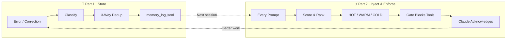

# Cortex Memory

### The governance-forced memory layer for Claude Code.

**The first AI memory system that actually works.**

---

Every memory tool you've tried has the same problem.

You correct Claude. The memory tool stores it. Next session, it injects the correction into the prompt.

And Claude ignores it.

Not sometimes. Routinely. Measured compliance with injected instructions is **under 30%** in agent scenarios. Your correction is sitting right there in the context window and Claude blows past it like it doesn't exist.

This isn't a bug in Mem0 or Zep or CLAUDE.md. It's a **fundamental design flaw**. To Claude, injected memories look like noise. Optional context. Background information it can choose to skip.

Every existing memory system injects and hopes.

**Cortex Memory injects and blocks.**

---

## How It Works

Think of it like your brain.

Your brain doesn't load every memory into consciousness every time you do something. It makes **connections** — this situation reminds me of that experience. It scores **relevance** — this memory matters right now, that one doesn't. And when something is important enough, it **forces your attention** — you can't ignore it.

Cortex works the same way. Two parts:

### Part 1: The Hook — Makes Connections

Every time you correct Claude, every time it solves a bug, every time a session ends — Cortex captures it automatically. No commands. No manual saves.

Then it does what your brain does:

- **Scores relevance** — IDF-weighted keywords, stem matching, tag boosting, recency decay
- **Surfaces what matters** — Only memories that score above threshold get injected
- **Lets the rest fade** — Old, irrelevant memories decay naturally. The corpus self-corrects.

### Part 2: The Gate — Forces Attention

This is the part no other system has.

After memories are injected, Claude tries to write code. The gate **blocks it**. Edit? Blocked. Bash? Blocked. Write? Blocked.

Claude has to acknowledge what it learned from past sessions before it can touch a single file.

One block per cycle. Self-consuming. But non-negotiable.

**This is why Cortex works and everything else doesn't.** Other systems give Claude a choice. Cortex doesn't.

---

## The Numbers

We researched every competitor. These are real, verifiable figures.

### Token Cost — 93% Less Than CLAUDE.md

| System | Tokens Per Prompt |
|--------|------------------|
| **Cortex Memory** | **~1,000** (hard capped) |
| CLAUDE.md | 5,000–15,000+ |
| MemGPT / Letta | ~2,081 base + 2K–8K blocks |
| Zep | ~1,600 average |
| Mem0 | ~200–3,000 |

When nothing is relevant, Cortex injects **30 tokens**. Not 5,000. Not 15,000. Thirty.

Every token earned its place through scoring. Nothing loads "just in case."

That's 0.1% of Claude's context window. The rest stays available for your actual work.

### Speed — All Local, No Waiting

| System | Search Latency | Write Latency |
|--------|---------------|---------------|
| **Cortex Memory** | **23–450ms** | **<50ms** |
| Mem0 | ~200ms + API roundtrip | 2–4 seconds (2 LLM calls) |
| Zep | <200ms + graph traversal | 6–10 LLM calls |
| MemGPT / Letta | 50–300ms + full LLM call | **2–7 minutes** |

Cortex searches 6,000+ entries in milliseconds. All local. No API roundtrips. No network latency.

No MCP servers. No Node.js processes. No Docker containers. No vector databases.

Just Python and your filesystem.

### Dependencies — None

| System | What You Need Installed |
|--------|------------------------|
| **Cortex Memory** | **Python 3.10+** |
| Mem0 | OpenAI API key, Qdrant, PostHog telemetry |
| MemGPT / Letta | Docker, PostgreSQL, LLM API, 42 database tables |
| Zep | Neo4j, OpenAI API, BGE embedding models |
| claude-mem | Node.js, Bun, uv, Chroma, worker service |

Zero external dependencies. Pure Python stdlib. No API keys required. No telemetry phoning home.

### Enforcement — The Only System That Forces It

| System | Can Claude Ignore Memories? |
|--------|---------------------------|
| **Cortex Memory** | **No.** |
| Everyone else | Yes. |

This is the column that matters. Everything else is optimization. If Claude can ignore your memories, your memory system doesn't work.

---

## Install in 30 Seconds

```bash
pip install cortex-memory
cortex-install
```

Done.

`cortex-install` creates `~/.cortex/` for your memory data and registers the hooks + gate in Claude Code's settings. Next session, it's active.

- First session: captures automatically as you work
- Second session: Claude remembers what it learned
- Tenth session: it knows your codebase, your patterns, your preferences

```bash
cortex-install --dry-run      # Preview changes
cortex-install --uninstall    # Remove hooks, keep your data
```

---

## The Self-Correcting Loop



**Capture → Score → Inject → Block → Acknowledge → Improve → Repeat.**

Every session feeds the next. Claude gets measurably better at your specific codebase, your preferences, and your patterns — automatically, forever.

---

## How the Scoring Works

Your brain doesn't treat all memories equally. Neither does Cortex.

```
score = (keyword_match + stem_match + substring_match)
        × tag_boost(2.0)
        × correction_boost(1.5)
        × recency_decay
        × coverage_factor
```

**In plain English:**

- **Keywords** — "docker postgres error" matches entries about Docker Postgres errors. Common words like "the" are downweighted. Rare, specific terms get boosted.
- **Stems** — "deploying" matches "deploy", "deployed", "deployment". You don't need exact words.
- **Tags** — Entries tagged with your current domain get a 2x boost.
- **Corrections** — Things YOU told Claude get a 1.5x boost over things Claude figured out on its own. Your voice is louder.
- **Recency** — Last week's correction: 81% strength. Last month: 41%. Three months: 7%. Fresh knowledge wins.
- **Coverage** — Entries matching multiple query terms rank higher than single-term matches.

**Tiered injection:**

| Score | What Happens |
|-------|-------------|
| ≥ 0.3 (HOT) | Full content injected |
| 0.15–0.3 (WARM) | Summary only |
| < 0.15 (COLD) | Not injected |

On benchmarks against 4,400+ entries: **Cortex 10/10 correct. SQLite FTS5: 4/10.**

---

## How Storage Works

Think of it like a self-cleaning filing cabinet.

Every memory goes through a three-way dedup check before it's stored:

- **>50% similar to existing entry?** Skip it. Already know this.
- **30–50% similar but longer/better?** Replace the old one. Supersede.
- **<30% similar?** New knowledge. Append it.

This is inspired by [Mem0's deduplication research](https://github.com/mem0ai/mem0) but runs locally without any LLM calls.

**Corrections supersede mistakes.** If Claude learned something wrong on Monday and you corrected it on Tuesday, Tuesday's correction replaces Monday's mistake. The wrong version is gone. The right version stays.

Over time, the corpus converges toward accuracy. Duplicates collapse. Stale entries fade. Wrong entries get replaced. You never curate anything.

---

## Configuration

All tunable via environment variables:

| Variable | Default | What It Does |
|----------|---------|-------------|
| `CORTEX_MEMORY_DIR` | `~/.cortex` | Where your memory data lives |
| `GEMINI_API_KEY` | *(none)* | Optional: semantic query expansion |
| `CORTEX_DECAY_RATE` | `0.03` | How fast old memories fade |
| `CORTEX_HOT_THRESHOLD` | `0.3` | Score needed for full injection |
| `CORTEX_WARM_THRESHOLD` | `0.15` | Score needed for summary injection |
| `CORTEX_MAX_INJECTION_CHARS` | `4000` | Hard cap on context used |

---

## Architecture

Four subsystems, zero external dependencies:

- **Hooks** (`cortex/hooks/`) — Capture, injection, enforcement
- **Store** (`cortex/store/`) — Three-way dedup, JSONL append-only log, scoring engine
- **Classifiers** (`cortex/classifiers/`) — Entry classification, keyword extraction
- **Maintenance** (`cortex/maintenance/`) — Distillation, archival, cache management

Battle-tested with 6,000+ entries across months of daily production use.

Full technical deep-dive: [ARCHITECTURE.md](ARCHITECTURE.md)

---

## License

[MIT](LICENSE) — Caleb Dane, 2026.
